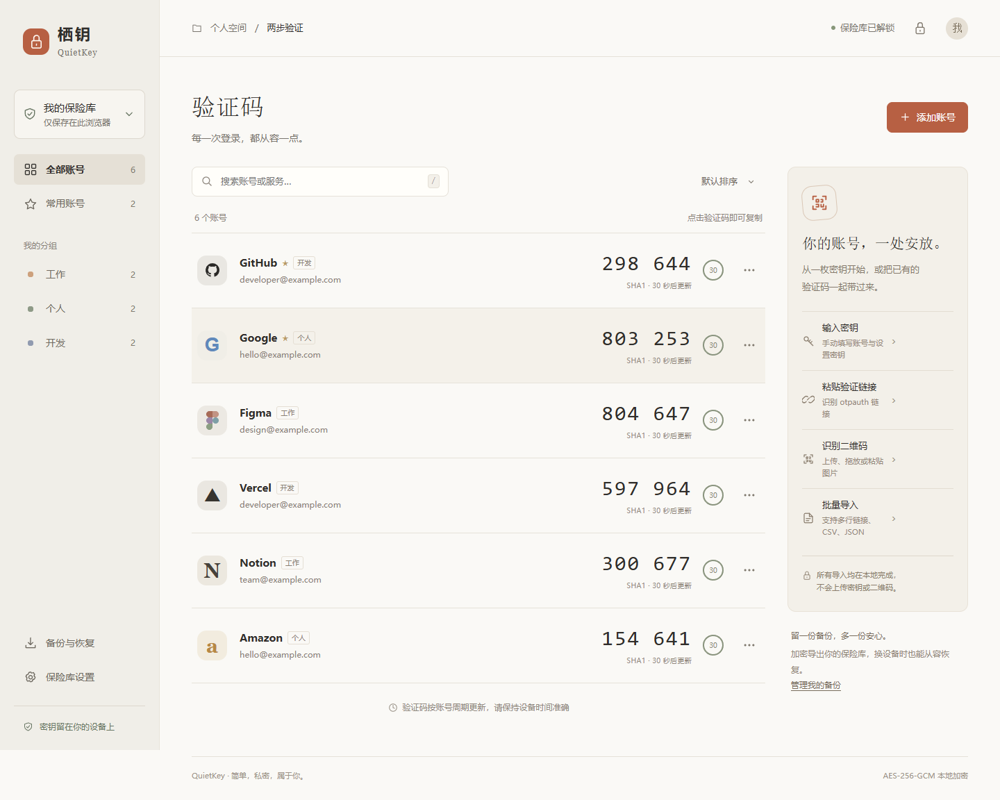
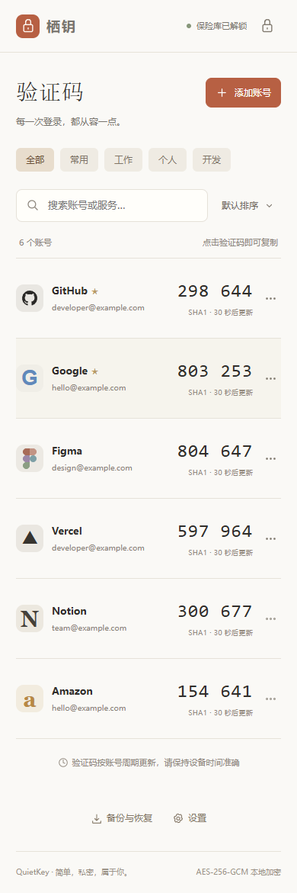

<p align="center">
  
</p>

<h1 align="center">栖钥 QuietKey</h1>

<p align="center">每一次登录，都从容一点。<br>本地加密的两步验证码管理工具，支持原始密钥导出与跨设备追加迁移。</p>

<p align="center">
  <a href="https://github.com/tianyin231/QuietKey2fa/releases/latest"></a>
  <a href="./LICENSE"></a>
  <a href="#功能"></a>
</p>

<p align="center">
  <a href="https://tianyin231.github.io/QuietKey2fa/"><strong>在线使用</strong></a> ·
  <a href="https://github.com/tianyin231/QuietKey2fa/releases/latest/download/QuietKey-offline.html"><strong>下载离线版</strong></a> ·
  <a href="https://github.com/tianyin231/QuietKey2fa/releases">版本更新</a> ·
  <a href="https://github.com/tianyin231/QuietKey2fa/issues/new/choose">反馈问题</a>
</p>



<p align="center"><sub>界面截图中的账号和密钥均为专门生成的测试数据。</sub></p>

<details>
<summary>查看手机界面</summary>

<p align="center"></p>

</details>

栖钥是纯静态前端：无需注册、后端或数据库，在浏览器本地生成 TOTP 验证码。可以直接使用在线版，也可以下载一个 HTML 文件离线使用。

**网站更新的是程序，账号数据保存在你的浏览器里。不同域名、设备和浏览器之间不会自动同步，请通过加密备份迁移。**

[快速开始](#快速开始) · [功能](#功能) · [导出与迁移](#导出与迁移) · [导入格式](#导入格式) · [数据与安全](#数据与安全) · [部署与开发](#部署与开发)

## 快速开始

### 在线使用

1. 打开 **[GitHub 在线版](https://tianyin231.github.io/QuietKey2fa/)**。
2. 点击「创建我的保险库」，设置主密码。
3. 点击「添加账号」，输入服务提供的密钥，或导入验证链接、二维码、CSV、JSON。
4. 点击验证码即可复制。账号添加完成后，建议导出一份加密备份。

已有栖钥备份且新设备上尚无账号时，也可以从首页点击「已有备份？恢复保险库」。

### 单文件离线版

从 [最新版本](https://github.com/tianyin231/QuietKey2fa/releases/latest) 下载 **`QuietKey-offline.html`**，使用现代浏览器打开。不需要安装 Node.js 或启动服务，样式、脚本和二维码识别库均已内置。

也可以下载仓库中的 [栖钥-离线版.html](./栖钥-离线版.html) 原始文件；不要把 GitHub 的文件展示页面保存为离线版。部分手机的文件预览器不能完整运行网页，这时请使用 HTTPS 在线版。

## 功能

| 功能 | 支持内容 |
| --- | --- |
| 验证码 | TOTP 实时生成、倒计时、一键复制；SHA1 / SHA256 / SHA512 |
| 账号管理 | 搜索、分组、常用标记、排序、编辑和删除 |
| 导入账号 | Base32 密钥、`otpauth://totp/` 链接、二维码图片、批量文本、CSV、JSON |
| 原始密钥 | 单个账号显示与复制；全部账号导出为密钥 TXT、明文 JSON 或验证链接 |
| 加密备份 | 导出加密 JSON，兼容已有栖钥备份 |
| 追加迁移 | 解密后预览，只追加缺少的账号，保留当前账号和主密码 |
| 本地存储 | AES-256-GCM 加密后存入浏览器；主密码不保存 |
| 自动锁定 | 默认无操作 5 分钟锁定，可在当前页面设为 1、5 或 15 分钟 |
| 使用方式 | 桌面、手机浏览器，以及单文件离线 HTML |

## 导出与迁移

### 获取原始 2FA 密钥

- **单个账号**：点击账号右侧「⋯」→「显示密钥」或「复制密钥」。取得的是 Base32 设置密钥，不是不断变化的验证码。
- **批量导出**：打开「备份与恢复」→「导出密钥」，选择下面的格式。

| 导出格式 | 保留的信息 | 适合用途 |
| --- | --- | --- |
| 加密 JSON 备份 | 全部账号与设置，需要备份时的主密码 | 日常备份、栖钥之间迁移 |
| 明文 JSON | 账号、原始密钥、算法、位数、周期、分组、常用标记 | 批量追加、自行处理数据 |
| 原始密钥 TXT | 每行一个 Base32 密钥 | 仅需要原始字符串时使用 |
| 验证链接 TXT | 每行一个 `otpauth://totp/` 链接，含账号与验证码参数 | 导入支持该格式的其他工具 |

明文文件包含可生成验证码的密钥，请妥善保管。原始密钥 TXT 不含账号名称和算法等设置；需要完整迁移时，优先选择加密备份或明文 JSON。

### 换设备时追加账号，不覆盖已有数据

1. **旧设备**：打开「备份与恢复」→「导出加密备份」。
2. **新设备**：先创建或解锁自己的保险库。
3. 打开「备份与恢复」→「合并导入」，选择旧设备导出的 JSON。
4. 输入**旧备份的主密码**，核对预览后点击「添加」。

导入后仍使用**新设备原来的主密码**。相同密钥、算法、位数和周期的条目会跳过；已有账号的名称、分组和常用标记不会被覆盖。账号名称相同但密钥不同的条目仍会追加。

「添加账号 → 批量导入」也能识别加密备份，并引导输入备份主密码。旧版本导出的栖钥加密 JSON 可直接使用。

### 完整恢复与合并的区别

| 操作 | 现有账号 | 解锁密码 |
| --- | --- | --- |
| **合并导入** | 保留，追加新账号 | 继续使用当前保险库主密码 |
| **从备份替换恢复** | 替换为备份中的账号 | 改为备份的主密码 |

完整替换入口位于「备份与恢复 → 替换整个保险库」，需要明确勾选确认。已有账号的新设备通常应选择「合并导入」。

## 导入格式

支持 TOTP，验证码位数为 **6 或 8**，更新周期为 **15–120 秒的整数**，默认 SHA1 / 6 位 / 30 秒。一次最多导入 5000 个账号，合并后的保险库也最多保存 5000 个账号；文件最大 10 MB。

以下均为公开测试数据，请勿用于真实账号。

<details>
<summary>验证链接、CSV、JSON 和原始密钥示例</summary>

**验证链接**：可以粘贴一条或多行。

```text
otpauth://totp/Example:demo%40example.com?secret=JBSWY3DPEHPK3PXP&issuer=Example&algorithm=SHA1&digits=6&period=30
```

**CSV**：不带表头时按 `服务名称,账号,密钥` 排列，也支持同名字段表头。

```csv
issuer,account,secret,algorithm,digits,period,group
Example,demo@example.com,JBSWY3DPEHPK3PXP,SHA1,6,30,个人
```

**JSON**：支持账号数组，或包含 `accounts` 数组的对象。

```json
{
  "accounts": [
    {
      "issuer": "Example",
      "account": "demo@example.com",
      "secret": "JBSWY3DPEHPK3PXP",
      "algorithm": "SHA1",
      "digits": 6,
      "period": 30,
      "group": "个人",
      "favorite": false
    }
  ]
}
```

**原始密钥**：每行一个 Base32 密钥。手动输入时可以包含空格或连字符，保存时会规范化。

```text
JBSWY3DPEHPK3PXP
```

</details>

二维码入口支持上传、拖放和粘贴图片，文件最大 10 MB。每张图片放置一个清晰、完整的标准 `otpauth` 二维码，识别在本机完成。

## 数据与安全

「保险库」是本地加密数据的名称，不是云端账户。

```text
主密码 + 随机盐
    → PBKDF2-SHA256（600,000 次迭代）
    → AES-256-GCM 加密
    → 浏览器 localStorage / 加密 JSON 备份
```

- 每个保险库使用 16 字节随机盐；每次保存生成新的 12 字节随机 IV。
- 浏览器存储和加密备份不含明文主密码或明文账号密钥；主动导出的明文文件除外。
- 应用不提供云同步或密钥上传功能，二维码库随项目分发，不从第三方 CDN 动态加载。
- 解锁后，内存中会存在解密后的账号；锁定会释放应用持有的账号和密钥引用，不代表浏览器内存已被可验证地擦除。
- 主密码无法找回。清除站点数据、结束无痕会话或清理浏览器存储可能移除保险库，请保留加密备份及服务本身的恢复码。

本地加密不能抵御已解锁页面中的恶意脚本、恶意扩展或被控制的设备。项目尚未经过独立安全审计。发现涉及密钥、加密或数据泄露的问题，请按 [安全报告说明](./SECURITY.md) 私密报告。

## 常见问题

<details>
<summary>为什么换网址、换手机后账号不见了？</summary>

账号加密保存在原设备、原浏览器、原站点的本地存储中。GitHub Pages 和其他域名的数据互不迁移，程序更新也不会上传账号。请在原位置导出加密备份，然后在新位置合并导入或恢复。

</details>

<details>
<summary>为什么导出的 JSON 看不到原始密钥？</summary>

「导出加密备份」得到的是密文。要取得原始字符串，请使用「导出密钥」选择明文 JSON / TXT，或在单个账号的管理窗口复制密钥。

</details>

<details>
<summary>更新网页会清空已有账号吗？</summary>

继续使用同一浏览器、同一站点地址，正常更新静态网页不会清除本地保险库。不要为了刷新页面而清除站点数据；更换域名或浏览器前先备份。

</details>

<details>
<summary>验证码不正确或复制失败怎么办？</summary>

先检查系统自动校时，以及账号的密钥、算法、位数和周期。剪贴板能力受浏览器权限限制；失败时可手动选择复制。原始密钥的复制失败时，页面会显示并选中密钥，方便手动复制。

</details>

### 当前限制

- 仅支持 TOTP；不支持 HOTP、Steam Guard 专用验证码和 Google Authenticator 的 `otpauth-migration://` 迁移二维码。
- 二维码入口处理图片，尚无摄像头实时扫描。
- 不提供云同步、主密码找回或主密码修改入口。
- 尚无 PWA 安装和 Service Worker 离线缓存；托管版不保证断网后重新打开可用，离线使用请下载单文件版。

## 部署与开发

### GitHub Pages

本仓库已使用 **`main` 分支 / 根目录** 发布，推送到 `main` 后会自动更新 [在线站点](https://tianyin231.github.io/QuietKey2fa/)。根目录 `index.html` 引导到 `dist/`，`.nojekyll` 保证静态文件直接发布。

自行 Fork 后，在 **Settings → Pages → Deploy from a branch** 选择 `main` 和 `/(root)`。部署状态可在 **Actions → pages build and deployment** 查看。参见 [GitHub Pages 官方说明](https://docs.github.com/en/pages/getting-started-with-github-pages/configuring-a-publishing-source-for-your-github-pages-site)。

### 其他静态托管

上传 [`dist/`](./dist) 目录中的全部文件即可，不需要服务器运行时、安装依赖或执行构建。也可以将离线 HTML 重命名为 `index.html` 后单独托管。请使用 HTTPS 以启用浏览器 Web Crypto。

### 本地开发

使用 **Node.js 22 或更高版本**。

```bash
git clone https://github.com/tianyin231/QuietKey2fa.git
cd QuietKey2fa
npm start
```

打开 `http://127.0.0.1:8765`。没有需要安装的 npm 依赖，无需运行 `npm install`；本地服务器只监听本机地址。

| 命令 | 用途 |
| --- | --- |
| `npm start` | 启动本地静态文件服务器 |
| `npm run build:standalone` | 将 `dist/` 打包为离线 HTML，包含许可文本 |
| `npm test` | 重新打包，并运行核心逻辑与离线文件检查 |

```text
QuietKey2fa/
├── dist/                     # 可直接部署的静态源码
│   ├── app.js                # 界面、密钥导出、备份与合并导入
│   ├── core.mjs              # TOTP、数据解析与加密
│   ├── index.html / style.css
│   └── vendor/               # jsQR 及 Apache 2.0 许可证
├── tests/                    # 算法、迁移、加密和打包检查
├── build-standalone.mjs       # 单文件打包
├── server.mjs / start.ps1     # 本地启动
├── index.html / .nojekyll     # GitHub Pages 入口
└── 栖钥-离线版.html            # 可分发的离线版本
```

修改 `dist/` 后执行 `npm test`，并一并提交重新生成的离线 HTML。测试包含 RFC 6238 的 18 组参考向量、导入导出往返、去重合并、不同主密码迁移、错误密码和密文篡改拒绝、离线脚本 CSP 一致性。

## 反馈与参与

- 使用问题与功能建议：[创建 Issue](https://github.com/tianyin231/QuietKey2fa/issues/new/choose)。请使用虚构账号复现，不要上传真实密钥、二维码或备份文件。
- 提交代码：[贡献说明](./CONTRIBUTING.md)。
- 安全问题：[私密漏洞报告](https://github.com/tianyin231/QuietKey2fa/security/advisories/new)。
- 下载与更新：[Releases](https://github.com/tianyin231/QuietKey2fa/releases)。

## 许可证与致谢

项目原创代码采用 [MIT 许可证](./LICENSE)。第三方二维码库 [jsQR](https://github.com/cozmo/jsQR) 遵循 [Apache 2.0](./dist/vendor/jsQR.LICENSE)，其许可文本也保留在生成的离线 HTML 中。

TOTP 实现遵循 [RFC 6238](https://www.rfc-editor.org/rfc/rfc6238)。
